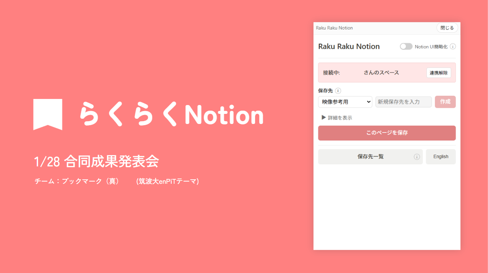
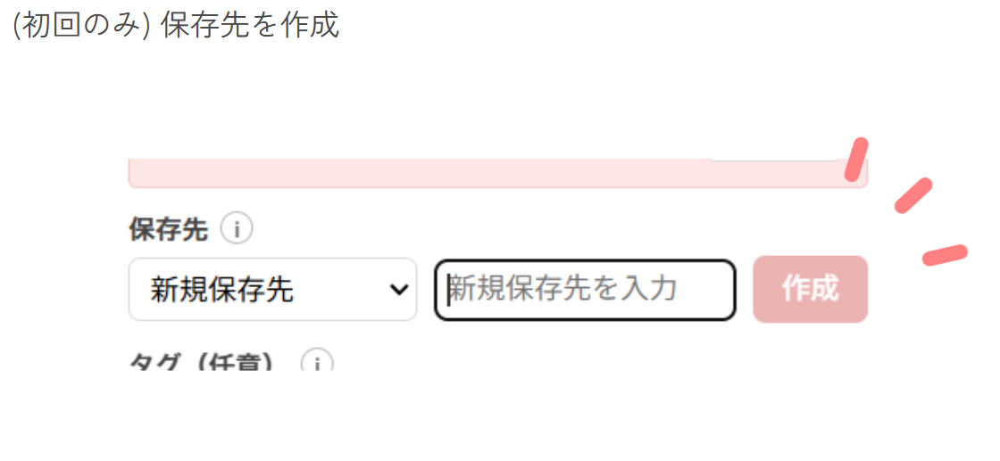
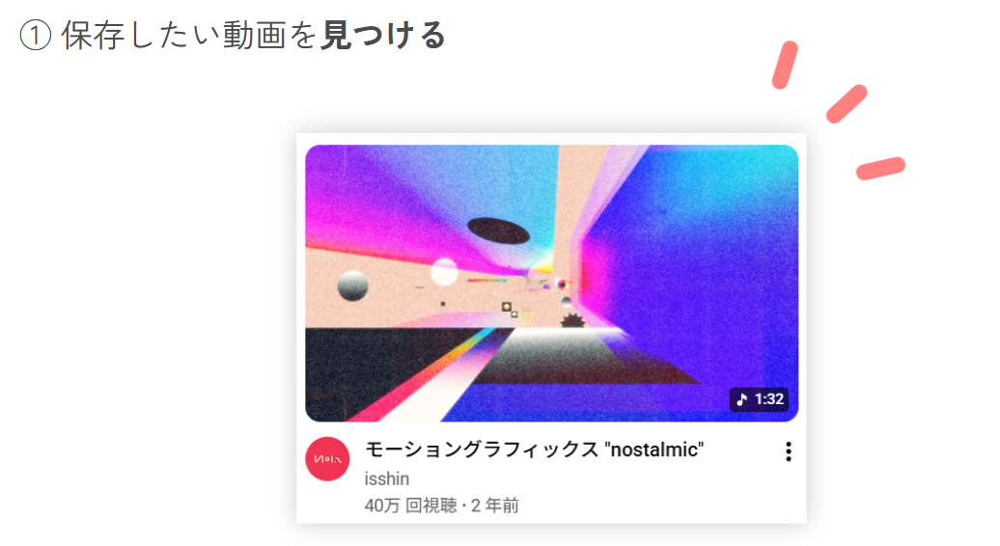
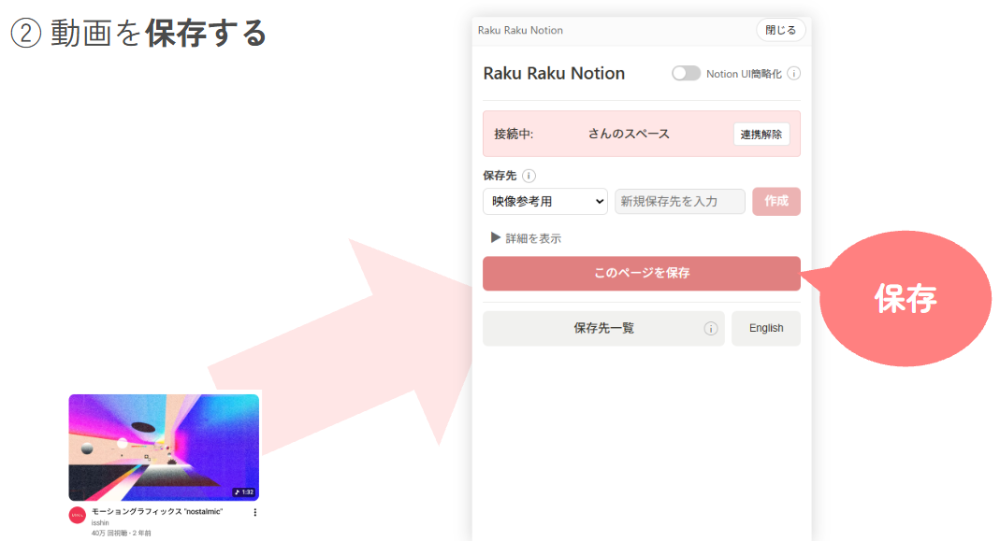
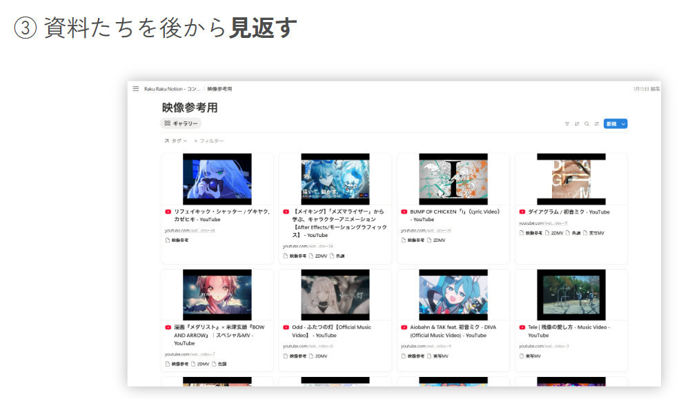
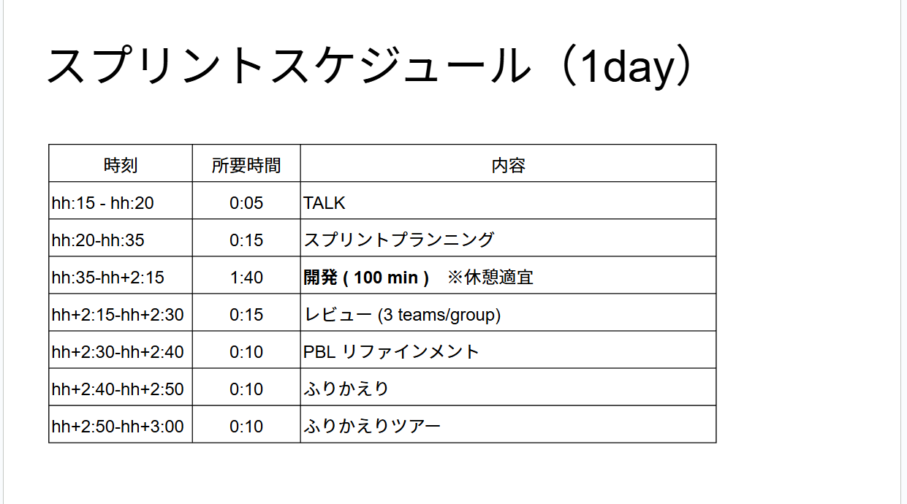
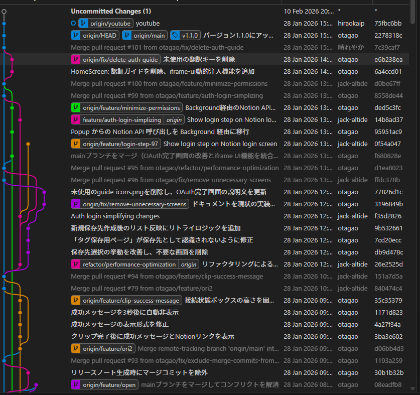
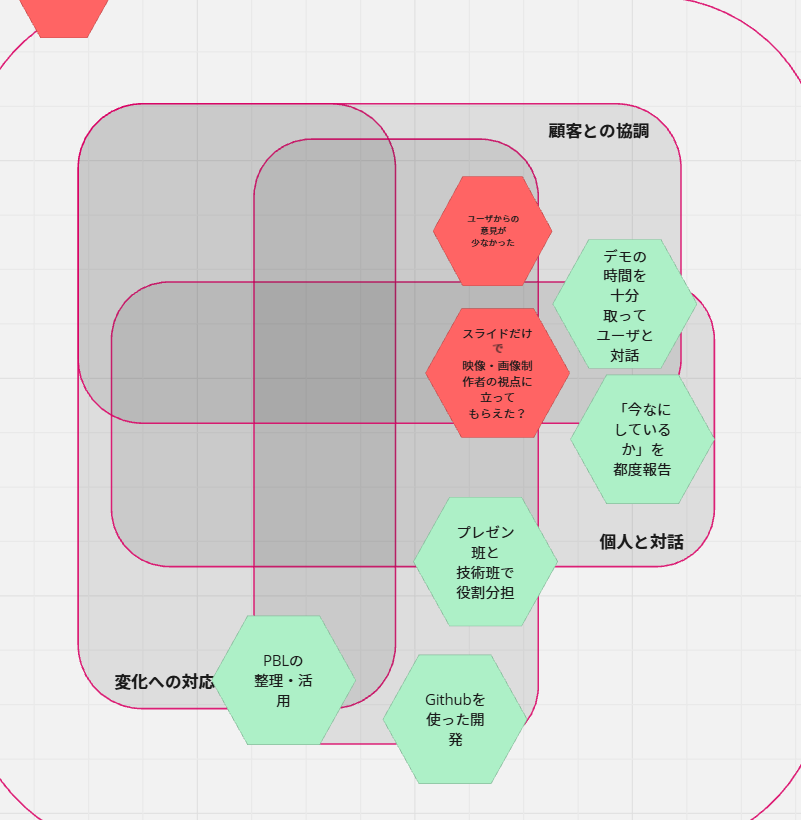
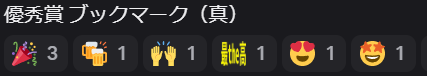

夏季集中と秋学期で、enPiTでチーム開発に取り組みました。この記事では、作ったプロダクトのこと、チームのこと、スプリントごとの歩み、そして個人的なふりかえりをまとめてみます。

---

## 作ったもの

↑PMの方(平井さん)のスライドをお借りしました…(使い方の手順とかもそうです)マジで見やすいスライドで感謝だし頭が上がらない
<!-- TODO: プロダクト名を記載 -->
まず自分のチームでは**らくらくNotion** というプロダクトを開発しました。

<!-- TODO: どんなプロダクトか、誰のためのものか、どう使うかを自分の言葉で -->
これは、映像制作者や画像制作者が自らの創作活動において使う参考資料(画像とか動画ですね)を、横断的に色々なSNSやサイトをブックマークしてまとめるという一連の動作があって、その動作を頭から最後までサポートするGoogle Chromeの拡張機能です。

### 使い方をざっくり紹介

<!-- TODO: スクリーンショットや画面の流れがあるとわかりやすい -->

---

## チームのこと

<!-- TODO: チーム名があれば記載 -->

### メンバーと役割

**平井さん — PM**
このプロダクトの顧客のペルソナで、発表とかを特に担当していただいた。後、結局どういうプロダクトだとうれしいのかというのを語ってもらったりした。

**磯部さん — SM**
各スプリントで進行役をしていただいたり(今日何をするか、ロングレビューまでに何をするかを彼中心で話を進めていただいた)、発表とかもしていただいた。意味わからんボケ、本当にありがとう。

**小田さん**
コーディング班のリーダー的存在で、小田さんがリポジトリを作って、git周りのことやリポジトリの管理を扱っていただいた。また、筋の通った意見をしていただくことが多くて、かなりプロダクト自体がいい方向に進んだと思う。~~bibe codingは彼が持ち込んだ文化です。~~

**玉緒さん**
コミュ力が凄いので、レビューの際に顧客の思っていることを引き出していただいた。また、発表やチームを盛り上げるような明るさでスプリントを円滑に進めるサポートをしていただいた。~~右クリック?そんなの関係ねえ。~~

**平岡さん**
コーディング班としてかなり開発を担当していただいたり、UI/UXではアイデアを色々考えて下さった。あと、ブログ呼んでる人的には言ってる意味が分かんないと思うんですけど、彼は**最強の武器と最強の盾を併せ持った武人**として知られています。

**自分の立ち位置**
コーディング班の一人として、PRのレビューを行ったり、時にはissueを解決するためコーディングしたり、スプリントの進め方やプロダクトの方向性に意見した。自分と磯部さんが対話のような形でスプリントを進めることが多かったと思う。

---

## スプリントの記録(プロダクト・チームの軌跡)

各回でスプリントを回しながら開発を進めました。

### ~夏季期間終了

<!-- TODO: 各スプリントの内容を記入 -->

この段階では、本当にそのプロダクト顧客がいるの?ということを調査したり(インタビュー)、とかスクラムという開発手法やアジャイル思考を実践して学んだりということをしました。

自分が発言した内容だったと思うんですけど、このプロダクト顧客いなくね?ってなったときに、でも平井さんはそれを欲しいと思ったんだから、平井さん自身をターゲットにすればいいんじゃないという提案をさせていただいて、プロダクトが挫折することなく最後まで行けたということがありました。

この時点で、チームメンバーそれぞれに作業がある人と、ない人はっきり出てきてしまったので、対話を通して作業分担をするのが大事だし、個人を理解して適切な作業や役割を与えることが重要だなという後の気付きに繋がりました。

### ~ロングレビュー2

まず、ブックマーク機能を作ろうとなった時に、フルスクラッチで開発してもNotionとかobsidianとか使ってた人間がそっちに乗り換えてくれるかわからないので、Notionを挫折してしまった元Notionユーザを対象としたプロダクトにしようということで話がまとまりました。

けど、やっぱりここで問題だったのが、**1スプリント短すぎ問題**でした。

1スプリントの開発時間がが100分しかないのでスプリント内でプランニングしてるだけでめっちゃ時間食います。スプリントゴールの設定もその日中に終わらせられるラインを見極めるのが大変でした。

しかし、何度もスプリントを回していく内に、最終的にはロングレビュー2の段階でNotionへのブックマークが拡張機能で出来るようになりました。

ロングレビュー1はクイズ形式でNotionの機能でこれ使ってる?みたいなのを聞いて、拡張機能で機能を省いてシンプルな表示にしたいので、どの機能がいらないの?という調査をしていきました。
んで、いくつかのスプリントを経て、ロングレビュー2当日。

爆発。

はい、レビューが爆発しました。要は大失敗という結果に終わったということです。具体的に何が起こったかというと、Save to NotionっていうらくらくNotionの競合製品みたいな拡張機能があり、それと比較したいという話がありました。それで、レビュアーにそれぞれの拡張機能をPCに入れてもらってレビューしてもらおうと思ったんですが、この方法はいくつかの点で問題点がありました。

### 拡張機能の導入ってムズくね?

拡張機能をレビュアーそれぞれのPCに導入してもらうのは手順が多くて時間がかかりすぎてしまいました。

### Notionのアカウントをすでに持ってるかどうかで差が…

はい、差が出ました。

### 結局Save to Notionしか触ってもらえなかった

自分たちのプロダクトを触ってほしいですね。

まあ、こんな感じでデモはレビュアーが困惑しない現実的な範囲で設定しようというチーム内の暗黙知みたいなものが出来上がりました。

### ~ロングレビュー4

ロングレビュー2が終わってからはコーディングがどんどん進み、最初は小田さんが1人で開発を進めていましたがコンテキストを共有して複数人で開発ができるようになり、gitを使う機会が爆増しました。

↑最後のgit graphこんなんになりました

PBLがどんどんissueとして立てられ、そのissueが新機能追加やバグ改善によって解決されていき、またフィードバックでPBLが更新されていくというソフトウェア開発らしい迅速な開発サイクルがこの時期に回されていました。

デモ班と開発班に明確に役割を分けたりもしました。開発側で起こったことをデモ班に共有したり、その逆があったりと、作業内容を共有することの大事さというのがわかってきました。

ここで起こったこととして、3週くらい同じスプリントゴールで躓いて開発というかプロダクト自体が停滞したことがありました。内部APIを使うのが松案で一番良かったんですけど、それが技術的にグレーゾーンなのと、竹案や梅案がスプリントゴールの達成に行き着くまでに大変な案だったり、それを実現できてもインパクトが無いというのでかなりどうしようという状態になりました。

んで、結局メンターさんと話してenPiTでは何が体験できるかを優先させるのがいいんじゃない?ということで、内部APIを利用して開発を進めることにして、その場を何とか乗り切りました。

こういった拡張機能の仕様に際してNotionをいじる上で、同意をとらないのは倫理的にどうかとか、セキュリティ上どうなのかとか、技術的にグレーゾーンじゃね?という話題については、正直最後までどう割り切っても割り切れない問題として残ってしまった感があります。

顧客の体験第一なら認証とかする必要がないし、こういった部分に関しては正直**来年のenPiTでどういう態度が望ましいかを明言してほしい**という気持ちもあります。

### 最終チームAMF

<!-- 重要：最終のチームAMFは必ず含めてください！ -->
最後のスプリントで行ったチームのふりかえり（AMF）の内容です。

<!-- TODO: AMFの結果を記入 -->

まあここで言っておきたいのはターゲットがニッチだと、そもそもかなり狭い客層にヒットするように作ってるからそれ本当に必要とされているの?みたいなことがないからピボットとかは起きにくいけど、レビューの時困り続けるよということですね。

---

## ふりかえり

この秋学期で得たものをふりかえります。

<!-- TODO: 技術・チームワーク・開発プロセスなど、学んだことを自由に -->

**1.対話を通して作業分担・作業内容を共有するのが大事だし、個人を理解して適切な作業や役割を与えることが重要**

アジャイル思考の核の1つ、個人と対話です

**2.gitを用いたチーム開発ができ、ソフトウェアらしい迅速な開発サイクルを回す経験ができた**

**3.ソフトウェアを開発する以上問題は向こうからやってくるので、チームで話し合って対応をしよう**

**4.フィードバックはすべてを反映しなくてもいいが、自分たちだけじゃわからないプロダクトの弱みや強みに気付けることもある**

顧客と協調して、良いフィードバックを引き出すのが重要です

---
### 次にどう活かすか

<!-- TODO: この経験を今後どう使っていくか -->

自分は今回チーム開発初参加ということで、色々至らない点もありながらも、チームメンバーに助けられて優秀賞も獲得できました、やったね。

自分としては、この経験を経て次はより世の中にぶっ刺さるプロダクトの開発に携わりたいと思っています。

ブックマークって、人間がし続ける行為だと思っていて、その時々で人間の気分とかの流動的な状態によってブックマークしたいSNSの投稿とか動画とか画像とか記事とかって変わるじゃないですか?だから、それを画期的な方法でサポートするツール(ソフトウェア)は今のSNS時代で確実に顧客が求めるものだと自分は思っています。

また、以上のことからブックマークをAIに任せることは人間の全ての状態をAIがコンテキストとして把握しているとかじゃない限りできないので今回のようなAIをあまり使わないプロダクトでも、ピボットすれば今の人達に刺さるプロダクトになる気がしています(多分)。なので、プロダクトのその先の開発をしてみたいというのがちょっとずれてるかもしれませんが、次にどう活かすかの1つの答えです。

長くなりましたが、最後にチームメンバーの皆さん、メンターや教員、外部講師の方々に盛大な感謝を持って今回の投稿を閉じさせてもらいます。本当に半年間ありがとうございました。
